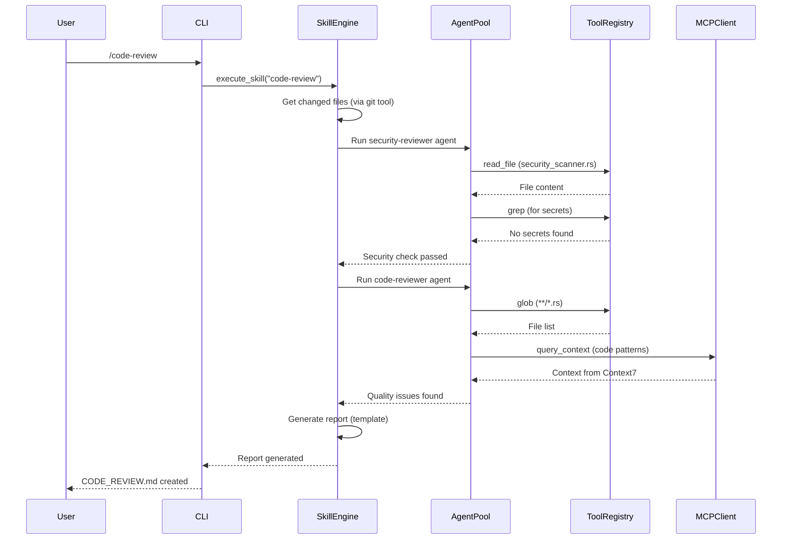

# RustyCode Extensibility Architecture

**Vision**: "A modular, composable AI coding assistant that users can extend at every layer"

---

## Overview: Four Extension Points

```
┌─────────────────────────────────────────────────────────────┐
│                     EXTENSION LAYERS                         │
├─────────────────────────────────────────────────────────────┤
│                                                               │
│  Skills (Human Workflows)          Tools (AI Capabilities)   │
│  ↓                                ↓                          │
│  Reusable prompt templates         Callable functions        │
│  Multi-step orchestration         With defined schemas      │
│  Human-in-the-loop                AI-executed                │
│                                                               │
│  MCP (Context Protocol)            Plugins (System Layer)    │
│  ↓                                ↓                          │
│  Standardized context              Runtime extensions        │
│  Exchange between tools           Compiled Rust/WebAssembly  │
│  Tool discovery & routing          Full system access        │
│                                                               │
└─────────────────────────────────────────────────────────────┘
```

---

## 1. Skills Layer (Human Workflows)

**Purpose**: Reusable, multi-step workflows that guide AI behavior

### What is a Skill?

A skill is a **declarative workflow specification** that:
- Defines multi-step processes (planning → TDD → code review → security)
- Encodes best practices (e.g., "always test first")
- Can be invoked by users or other skills
- Runs in the AI context (not compiled code)

### Skill Structure

```yaml
# .claude/skills/code-review/skill.md
name: code-review
version: 1.0.0
description: Comprehensive security and quality review of uncommitted changes

# When this skill should trigger
trigger:
  on_commit: true
  on_file_change: ["*.rs", "*.ts", "*.tsx"]
  manual_only: false

# Workflow steps (execute in sequence)
steps:
  - id: get-changed-files
    action: git
    command: diff --name-only HEAD
    output_var: changed_files

  - id: security-check
    action: agent
    agent_type: security-reviewer
    input: ${changed_files}
    requires_approval: critical_issues_found

  - id: code-quality-check
    action: agent
    agent_type: code-reviewer
    input: ${changed_files}

  - id: generate-report
    action: template
    template: |
      # Code Review Report

      Files changed: ${changed_files.length}
      Security issues: ${security_check.issues.length}
      Quality issues: ${quality_check.issues.length}

      Status: ${security_check.critical_issues > 0 ? 'BLOCKED' : 'APPROVED'}
    output_file: CODE_REVIEW.md

# Output expectations
outputs:
  - id: report_path
    value: CODE_REVIEW.md
  - id: status
    value: ${security_check.status}
```

### Skill Invocation

```bash
# Manual invocation
/code-review

# With parameters
/code-review --target-branch main

# Chained skills (orchestration)
/orchestrate feature "Add authentication"
  → internally invokes:
    1. /planner
    2. /tdd-guide
    3. /code-review (this skill)
    4. /security-review
```

### Skill Marketplace

```toml
# .claude/skills/marketplace.toml
[[skills]]
name = "golang-patterns"
version = "1.2.0"
author = "claude-code-official"
description = "Idiomatic Go patterns and best practices"
url = "https://github.com/anthropics/claude-code-skills/golang-patterns"
tags = ["go", "patterns", "best-practices"]
installed = true

[[skills]]
name = "django-verification"
version = "2.0.1"
author = "community"
description = "Django project verification workflow"
url = "https://github.com/user/django-skill"
tags = ["django", "python", "testing"]
installed = false
```

### Skill API

```rust
// crates/rustycode-runtime/src/skills/mod.rs

pub struct SkillEngine {
    skills: HashMap<String, Skill>,
    agent_pool: AgentPool,
}

impl SkillEngine {
    /// Load skills from .claude/skills/
    pub async fn load_skills(&mut self, skills_dir: PathBuf) -> Result<()> {
        // Discover and parse skill.md files
        // Validate schema
        // Register skill triggers
    }

    /// Execute a skill by name
    pub async fn execute_skill(
        &self,
        skill_name: &str,
        context: &Context,
    ) -> Result<SkillOutput> {
        let skill = self.skills.get(skill_name)
            .ok_or_else(|| anyhow!("Skill not found: {}", skill_name))?;

        for step in &skill.steps {
            match step.action {
                Action::Agent => self.run_agent_step(step, context).await?,
                Action::Git => self.run_git_step(step, context).await?,
                Action::Template => self.run_template_step(step, context).await?,
                // ... other actions
            }
        }

        Ok(skill.generate_output())
    }

    /// Auto-trigger skills based on events
    pub async fn check_triggers(&self, event: &Event) -> Vec<Skill> {
        self.skills
            .values()
            .filter(|skill| skill.matches_trigger(event))
            .cloned()
            .collect()
    }
}
```

---

## 2. Tools Layer (AI Capabilities)

**Purpose**: Callable functions that the AI can use to accomplish tasks

### What is a Tool?

A tool is a **schema-defined function** that:
- Has typed inputs and outputs (JSON Schema)
- Can be called by the AI during reasoning
- Executes code (Rust, Python, shell, or WASM)
- Returns structured results

### Tool Schema

```json
{
  "name": "read_file",
  "description": "Read a file from the local filesystem",
  "input_schema": {
    "type": "object",
    "properties": {
      "file_path": {
        "type": "string",
        "description": "Absolute path to the file"
      },
      "offset": {
        "type": "integer",
        "description": "Line number to start reading from (1-based)",
        "default": 1
      },
      "limit": {
        "type": "integer",
        "description": "Maximum number of lines to read",
        "default": 2000
      }
    },
    "required": ["file_path"]
  },
  "output_schema": {
    "type": "object",
    "properties": {
      "content": {
        "type": "string",
        "description": "File contents"
      },
      "line_count": {
        "type": "integer",
        "description": "Number of lines read"
      },
      "encoding": {
        "type": "string",
        "description": "Detected text encoding"
      }
    }
  },
  "execution": {
    "runtime": "rust",
    "handler": "crate::tools::read_file::execute",
    "timeout_ms": 5000,
    "permissions": ["read:filesystem"]
  }
}
```

### Tool Implementation

```rust
// crates/rustycode-tools/src/read_file.rs

use serde::{Deserialize, Serialize};
use anyhow::Result;

#[derive(Debug, Deserialize)]
pub struct Input {
    pub file_path: String,
    #[serde(default = "default_offset")]
    pub offset: usize,
    #[serde(default = "default_limit")]
    pub limit: usize,
}

#[derive(Debug, Serialize)]
pub struct Output {
    pub content: String,
    pub line_count: usize,
    pub encoding: String,
}

pub async fn execute(input: Input) -> Result<Output> {
    // Read file
    let content = tokio::fs::read_to_string(&input.file_path).await?;

    // Parse lines with offset/limit
    let lines: Vec<&str> = content
        .lines()
        .skip(input.offset.saturating_sub(1))
        .take(input.limit)
        .collect();

    let joined = lines.join("\n");

    Ok(Output {
        content: joined,
        line_count: lines.len(),
        encoding: detect_encoding(&content)?,
    })
}
```

### Tool Registry

```rust
// crates/rustycode-tools/src/lib.rs

pub struct ToolRegistry {
    tools: HashMap<String, Tool>,
}

impl ToolRegistry {
    pub fn register<T: Tool>(&mut self, tool: T) {
        let schema = tool.schema();
        self.tools.insert(schema.name.clone(), tool.into_boxed());
    }

    pub async fn execute_tool(
        &self,
        tool_name: &str,
        input: serde_json::Value,
    ) -> Result<serde_json::Value> {
        let tool = self.tools.get(tool_name)
            .ok_or_else(|| anyhow!("Tool not found: {}", tool_name))?;

        // Validate input against schema
        tool.validate_input(&input)?;

        // Execute with timeout
        let output = tokio::time::timeout(
            Duration::from_millis(tool.timeout_ms()),
            tool.execute(input),
        ).await??;

        // Validate output against schema
        tool.validate_output(&output)?;

        Ok(output)
    }
}
```

### Built-in Tools

```rust
// Register core tools
registry.register::<ReadFile>();
registry.register::<WriteFile>();
registry.register::<Glob>();
registry.register::<Grep>();
registry.register::<Bash>();
```

---

## 3. MCP Layer (Model Context Protocol)

**Purpose**: Standardized context exchange between tools and external systems

### What is MCP?

**MCP** (Model Context Protocol) is an open standard for:
- **Context discovery**: Tools advertise what context they provide
- **Context retrieval**: Systems request context from tools
- **Context normalization**: Structured context format
- **Tool chaining**: Tools can use other tools' context

### MCP Server Implementation

```rust
// crates/rustycode-mcp/src/server.rs

use mcp_sdk::{
    MCPServer,
    ContextProvider,
    Tool,
};

pub struct RustyCodeMCPServer {
    tools: Vec<Box<dyn Tool>>,
    context_providers: Vec<Box<dyn ContextProvider>>,
}

impl RustyCodeMCPServer {
    pub async fn start(&self, addr: SocketAddr) -> Result<()> {
        let server = MCPServer::new("rustycode", "1.0.0");

        // Register context providers
        for provider in &self.context_providers {
            server.register_context_provider(provider.as_ref()).await?;
        }

        // Register tools
        for tool in &self.tools {
            server.register_tool(tool.as_ref()).await?;
        }

        server.listen(addr).await?;
    }
}

// Context provider example: Git state
pub struct GitContextProvider;

#[async_trait]
impl ContextProvider for GitContextProvider {
    fn name(&self) -> &str {
        "git-state"
    }

    fn description(&self) -> &str {
        "Provides current git branch, status, and recent commits"
    }

    async fn provide_context(&self, _query: &ContextQuery) -> Result<Context> {
        let branch = git::current_branch()?;
        let status = git::status()?;
        let commits = git::recent_commits(5)?;

        Ok(Context::builder()
            .metadata("branch", branch)
            .metadata("status", serde_json::to_string(status)?)
            .documents("recent-commits", commits)
            .build())
    }
}

// Tool example: Code search
pub struct CodeSearchTool;

#[async_trait]
impl Tool for CodeSearchTool {
    fn name(&self) -> &str {
        "code-search"
    }

    fn description(&self) -> &str {
        "Search for code patterns in the workspace"
    }

    async fn execute(&self, input: ToolInput) -> Result<ToolOutput> {
        let query = input.get_param("query")?;
        let results = grep::search(&query).await?;

        Ok(ToolOutput::from(results))
    }
}
```

### MCP Client (for consuming external MCP servers)

```rust
// crates/rustycode-mcp/src/client.rs

pub struct MCPClient {
    servers: HashMap<String, MCPConnection>,
}

impl MCPClient {
    /// Connect to an MCP server
    pub async fn connect(&mut self, name: &str, url: &str) -> Result<()> {
        let connection = MCPConnection::connect(url).await?;
        self.servers.insert(name.to_string(), connection);
        Ok(())
    }

    /// Query context from all connected servers
    pub async fn query_context(&self, query: &ContextQuery) -> Result<Vec<Context>> {
        let mut contexts = Vec::new();

        for (name, server) in &self.servers {
            if let Ok(context) = server.query_context(query).await {
                contexts.push(context.with_source(name));
            }
        }

        Ok(contexts)
    }

    /// Execute tool on any connected server
    pub async fn execute_tool(
        &self,
        tool_name: &str,
        input: ToolInput,
    ) -> Result<ToolOutput> {
        // Find server that has this tool
        let server = self.find_tool_server(tool_name).await?;

        server.execute_tool(tool_name, input).await
    }
}
```

### MCP Integration Example

```rust
// Connect to external MCP servers
let mut mcp_client = MCPClient::new();

// Context7: Code context search
mcp_client.connect("context7", "mcp://context7.local").await?;

// Dune: Analytics database queries
mcp_client.connect("dune", "mcp://dune.local").await?;

// Fetch context when starting a task
let context = mcp_client.query_context(&ContextQuery {
    workspace_path: "/Users/nat/dev/rustycode",
    query: "how are agents implemented?",
}).await?;

// Use context in LLM prompt
let prompt = format!(
    "Context: {}\n\nQuestion: How do I implement a new agent?",
    context.to_string()
);
```

---

## 4. Plugins Layer (System Extensions)

**Purpose**: Runtime extensions compiled as Rust or WebAssembly

### What is a Plugin?

A plugin is a **compiled extension** that:
- Runs in the RustyCode process (or WASM sandbox)
- Has full system access (or sandboxed)
- Can extend any layer (UI, tools, agents, skills)
- Distributes as binary or WASM module

### Plugin Interface

```rust
// crates/rustycode-plugin/src/lib.rs

pub trait Plugin: Send + Sync {
    /// Plugin metadata
    fn metadata(&self) -> &PluginMetadata;

    /// Lifecycle hooks
    fn on_load(&mut self, context: &PluginContext) -> Result<()>;
    fn on_unload(&mut self) -> Result<()>;

    /// Extension points
    fn register_tools(&self, registry: &mut ToolRegistry) -> Result<()>;
    fn register_agents(&self, registry: &mut AgentRegistry) -> Result<()>;
    fn register_skills(&self, engine: &mut SkillEngine) -> Result<()>;
    fn register_ui_components(&self, ui: &mut UIManager) -> Result<()>;

    /// Event handlers
    fn on_file_change(&self, event: &FileChangeEvent) -> Result<()>;
    fn on_git_commit(&self, event: &GitCommitEvent) -> Result<()>;
    fn on_llm_response(&self, response: &LLMResponse) -> Result<()>;
}

#[derive(Debug, Clone)]
pub struct PluginMetadata {
    pub name: String,
    pub version: String,
    pub author: String,
    pub description: String,
    pub permissions: Vec<Permission>,
}
```

### Plugin Example: GitHub Integration

```rust
// plugins/github-integration/src/lib.rs

use rustycode_plugin::*;

pub struct GitHubPlugin;

impl Plugin for GitHubPlugin {
    fn metadata(&self) -> &PluginMetadata {
        &PluginMetadata {
            name: "github-integration".to_string(),
            version: "1.0.0".to_string(),
            author: "RustyCode Ensemble".to_string(),
            description: "GitHub PR/issue integration".to_string(),
            permissions: vec![
                Permission::Network,
                Permission::ReadGitCredentials,
            ],
        }
    }

    fn on_load(&mut self, context: &PluginContext) -> Result<()> {
        // Authenticate with GitHub
        let token = std::env::var("GITHUB_TOKEN")?;
        self.client = Some(GitHubClient::new(token)?);
        Ok(())
    }

    fn register_tools(&self, registry: &mut ToolRegistry) -> Result<()> {
        registry.register(GitHubPRTool::new(self.client.clone()));
        registry.register(GitHubIssueTool::new(self.client.clone()));
        Ok(())
    }

    fn on_git_commit(&self, event: &GitCommitEvent) -> Result<()> {
        // Auto-create GitHub PR if configured
        if self.should_auto_pr(event) {
            self.create_pr(event).await?;
        }
        Ok(())
    }
}

// Tool: Create GitHub PR
pub struct GitHubPRTool {
    client: GitHubClient,
}

#[async_trait]
impl Tool for GitHubPRTool {
    fn name(&self) -> &str {
        "github-create-pr"
    }

    fn description(&self) -> &str {
        "Create a GitHub pull request"
    }

    async fn execute(&self, input: ToolInput) -> Result<ToolOutput> {
        let title = input.get_param("title")?;
        let body = input.get_param("body")?;
        let base = input.get_param_or_default("base", "main")?;

        let pr = self.client
            .create_pr(&title, &body, &base)
            .await?;

        Ok(ToolOutput::from(serde_json::to_string(pr)?))
    }
}
```

### Plugin Loader

```rust
// crates/rustycode-plugin/src/loader.rs

pub struct PluginLoader {
    plugins: Vec<Box<dyn Plugin>>,
}

impl PluginLoader {
    /// Load plugins from ~/.claude/plugins/
    pub async fn load_plugins(&mut self, plugin_dir: PathBuf) -> Result<()> {
        let entries = tokio::fs::read_dir(plugin_dir).await?;

        for entry in entries {
            let entry = entry?;
            let metadata = entry.metadata().await?;

            if metadata.is_file() {
                let path = entry.path();

                // Load Rust plugin (.so/.dylib/.dll)
                if path.extension() == Some(OsStr::new("so")) ||
                   path.extension() == Some(OsStr::new("dylib")) ||
                   path.extension() == Some(OsStr::new("dll")) {
                    self.load_rust_plugin(path).await?;
                }

                // Load WASM plugin (.wasm)
                if path.extension() == Some(OsStr::new("wasm")) {
                    self.load_wasm_plugin(path).await?;
                }
            }
        }

        Ok(())
    }

    async fn load_rust_plugin(&mut self, path: PathBuf) -> Result<()> {
        unsafe {
            let lib = libloading::Library::new(&path)?;

            // Load plugin symbol
            let plugin_ctor: libloading::Symbol<fn() -> *mut dyn Plugin> =
                lib.get(b"plugin_create")?;

            let plugin = Box::from_raw(plugin_ctor());
            plugin.on_load(&self.context)?;

            self.plugins.push(plugin);
        }

        Ok(())
    }

    async fn load_wasm_plugin(&mut self, path: PathBuf) -> Result<()> {
        // Load WASM module
        let module = wat2wasm::parse_file(&path)?;
        let instance = Instance::new(&module, &Imports::default())?;

        // Wrap WASM exports as Plugin trait
        let plugin = WasmPlugin::new(instance)?;
        plugin.on_load(&self.context)?;

        self.plugins.push(Box::new(plugin));

        Ok(())
    }
}
```

---

## Integration: How All Layers Work Together

### Example Workflow: User runs `/code-review`



### Configuration File

```toml
# .claude/config.toml

[plugins]
# Load plugins from directory
dir = "~/.claude/plugins/"
# Specific plugins to load
load = [
    "github-integration",
    "jira-integration",
    "slack-notifications"
]

[mcp]
# Connect to MCP servers
[[mcp.servers]]
name = "context7"
url = "mcp://context7.local:8080"

[[mcp.servers]]
name = "dune"
url = "mcp://dune.local:8081"

[skills]
# Load skills from directory
dir = "~/.claude/skills/"
# Auto-run skills on events
[skills.auto_run]
on_commit = ["code-review", "security-check"]
on_file_change = ["format-check"]

[tools]
# Tool execution settings
timeout_ms = 30000
enable_sandbox = true
```

---

## Implementation Roadmap

### Phase 1: Foundation (Week 1-2)
- [ ] Design and implement Tool trait and Registry
- [ ] Implement core tools (Read, Write, Glob, Grep, Bash)
- [ ] Design MCP client/server interfaces
- [ ] Implement basic MCP server

### Phase 2: Skills Engine (Week 3-4)
- [ ] Design skill schema (YAML/JSON)
- [ ] Implement SkillEngine with step execution
- [ ] Create built-in skills (code-review, tdd-guide, security-review)
- [ ] Implement skill auto-triggering

### Phase 3: Plugin System (Week 5-6)
- [ ] Design Plugin trait and loader
- [ ] Implement Rust plugin loading (dlopen)
- [ ] Implement WASM plugin support (wasmtime)
- [ ] Create example plugins (GitHub, Jira, Slack)

### Phase 4: MCP Integration (Week 7-8)
- [ ] Complete MCP client implementation
- [ ] Implement context provider registration
- [ ] Connect to external MCP servers (Context7, Dune)
- [ ] Implement tool chaining via MCP

---

## Benefits

**For Users:**
- Extend RustyCode without modifying core code
- Share workflows via skills marketplace
- Integrate with external tools via MCP
- Install community plugins

**For Developers:**
- Plugin ecosystem drives adoption
- MCP standardizes context exchange
- Skills encode best practices
- Tools provide composable building blocks

**For the Ecosystem:**
- Open standard (MCP) enables interoperability
- Plugin marketplace fosters community
- Skills become shareable knowledge
- Tools become reusable components

---

*Extensibility Architecture v1.0*
*Plugins, MCP, Tools, Skills — Extend Every Layer*
